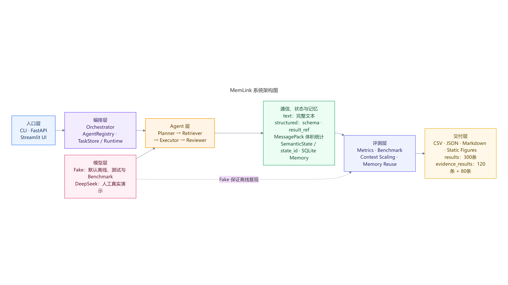
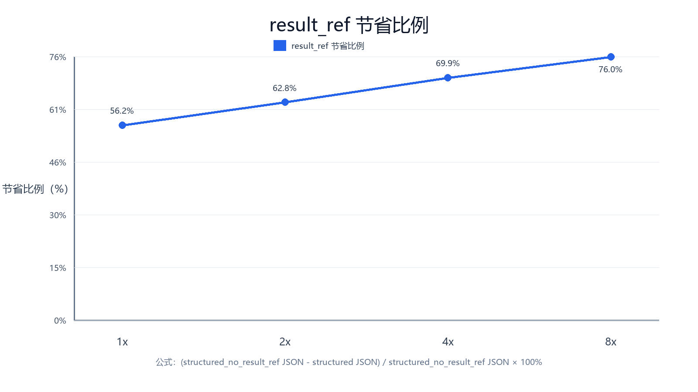
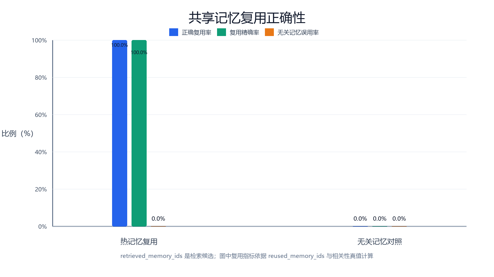

# MemLink

> 面向多智能体协作的低开销通信、非文本状态传递与跨任务共享记忆基础设施


MemLink它不是普通的多 Agent 聊天演示，而是一套可运行、可测试、可消融、可量化比较的协作基础设施。

本项目保留完整 text 基线，并实现 structured 协议、二进制语义状态、SQLite 共享记忆和离线 Benchmark；同一业务链路可使用 Fake 后端离线复现，也可由维护者手工切换到 DeepSeek 完成真实模型演示。

| 评审事实 | 当前实现 |
| --- | --- |
| 多智能体协作 | Planner → Retriever → Executor → Reviewer |
| 双通信模式 | text 基线 / structured 协议 |
| 非文本状态 | NumPy `float32` + `.npy` + `state_id` |
| 跨任务记忆 | SQLite Shared Memory |
| 模型后端 | Fake 默认离线 / DeepSeek 人工演示 |
| 目标平台 | Windows 开发 / openEuler 24.03-LTS-SP3 实机验证 |

## 快速导航

- [项目概览](#项目概览)
- [核心机制](#核心机制)
- [系统架构](#系统架构)
- [已验证结果](#已验证结果)
- [客观结论](#客观结论)
- [快速开始](#快速开始)
- [实验复现](#实验复现)
- [项目结构](#项目结构)
- [openEuler 实机验证](#openeuler-实机验证)
- [交付材料](#交付材料)
- [实验边界](#实验边界)
- [安全说明](#安全说明)

## 项目概览

| 项目 | 说明 |
| --- | --- |
| 核心问题 | 多 Agent 协作中完整上下文重复传递、状态文本化、跨任务经验难复用 |
| 协作链路 | Planner 规划，Retriever 检索，Executor 执行，Reviewer 审核 |
| 通信基线 | text 模式逐级传递完整自然语言文本 |
| 结构化方案 | `AgentMessage`、能力发现、动作字段、证据 ID、`result_ref` |
| 状态方案 | SemanticState 保存 NumPy 二进制向量，协议只传 `state_id` |
| 记忆方案 | SQLite 保存事实、证据、策略和成功/失败经验 |
| 评测方案 | 基础 Benchmark、上下文规模增长实验、共享记忆复用实验 |
| 服务入口 | CLI、FastAPI、Streamlit |
| 离线后端 | Fake LLM + Fake Embedding，pytest 与 Benchmark 不访问互联网 |
| 真实后端 | DeepSeek |
| 技术栈 | Python、FastAPI、Pydantic v2、NumPy、MessagePack、SQLite、pytest、Streamlit |

MemLink 将通信、状态、记忆、模型和评测拆为独立模块。三项消融开关可分别关闭 Shared Memory、SemanticState 和 `result_ref`，用于观察单一机制对指标的影响。

## 核心机制

### 1. text 与 structured 双模式

- **text**：四个 Agent 逐级传递完整自然语言文本，作为可解释的基线。
- **structured**：使用统一 schema 传递动作、参数、能力、置信度、证据 ID、状态 ID 和结果引用。
- 两种模式使用相同任务、相同 Agent 顺序和相同模型适配层，便于公平比较。
- `AgentRegistry` 根据 capability 发现 Agent，并校验 action 与目标能力。

### 2. MessagePack 与 result_ref

- structured 消息对同一批数据同时统计 JSON 与 MessagePack 序列化字节。
- MessagePack 用于紧凑编码体积比较，不把该指标误写成真实网络流量。
- `result_ref` 让下游只接收稳定引用和必要摘要，避免重复内联大结果。
- `structured_no_result_ref` 消融组恢复完整结果传递，用于量化引用机制。

### 3. SemanticState 非文本状态

- Retriever 生成 NumPy `float32` 向量，StateStore 以 `.npy` 二进制文件保存。
- 协议只携带 `state_id`、维度、类型、存储引用和必要元数据。
- 下游 Agent 按需读取并校验向量，不把完整向量转成字符串写入 Prompt。
- Benchmark 分别记录状态次数、二进制字节和引用字节。

### 4. SQLite 共享记忆

- 共享记忆与普通聊天历史分离，支持关键词、标签和向量相似度检索。
- 记忆保存 `memory_id`、摘要、证据、置信度、使用次数和来源 Agent。
- Reviewer 审核结果后写回可复用经验，后续相关任务可再次检索。
- 证据实验区分“检索候选”与“实际复用”，避免用命中数替代正确性。

## 系统架构

<p align="center">
  
</p>

入口层将请求交给 Orchestrator；编排器通过 AgentRegistry 发现能力，按 Planner → Retriever → Executor → Reviewer 顺序执行。structured 模式组合 MessagePack、`result_ref`、SemanticState 和 Shared Memory，最终由 Metrics 与 Benchmark 形成 JSON、CSV、Markdown 和静态图。

- [架构设计说明](docs/architecture.md)
- [可编辑 Mermaid 源码](docs/diagrams/memlink_architecture.mmd)
- [全部架构图与流程图索引](docs/diagrams/README.md)

## 已验证结果

### 基础离线 Benchmark

固定随机种子 `2026`，Fake 后端，2 组连续任务场景，每轮 6 个任务，5 个实验组各运行 10 轮，共形成 **300 条任务执行记录**。

| 实验组 | 记录数 | 完成率 | 消息均值 | JSON 均值 | MessagePack 均值 | P50 耗时 |
| --- | ---: | ---: | ---: | ---: | ---: | ---: |
| text | 60 | 100% | 4 | 8033.5 B | 0 B | 27.286 ms |
| structured | 60 | 100% | 9 | 7621.4 B | 6865.5 B | 48.491 ms |
| structured_no_memory | 60 | 100% | 9 | 6633.3 B | 5898.3 B | 7.421 ms |
| structured_no_semantic_state | 60 | 100% | 9 | 7230.4 B | 6481.5 B | 27.194 ms |
| structured_no_result_ref | 60 | 100% | 9 | 14363.8 B | 13178.1 B | 47.341 ms |

数据来源：[基础 Benchmark 报告](docs/benchmark_report.md) · [原始结果目录说明](benchmarks/README.md)

### 通信效率证据实验

上下文规模增长实验使用 `1x / 2x / 4x / 8x` 四档输入，比较 text、structured 与 structured_no_result_ref；每个组合 10 轮，共 **120 条记录**。在当前确定性任务中，`result_ref` 相对完整内联结果的 JSON 字节节省比例从 **56.2%** 增长到 **76.0%**。

<p align="center">
  
</p>

### 共享记忆复用证据实验

共享记忆实验覆盖 RAG 与 API 两个场景，以及 no_memory、cold_memory、warm_memory、irrelevant_memory 四种条件；每种条件 10 轮，共 **80 条目标任务记录**。warm_memory 的正确复用率和复用精确率均为 **100%**，irrelevant_memory 的无关记忆误用率为 **0%**。

<p align="center">
  
</p>

完整证据图：

- [E01：上下文规模与通信载荷](benchmarks/evidence_results/figures/E01_上下文规模与通信载荷.png)
- [E02：上下文规模与重复传输](benchmarks/evidence_results/figures/E02_上下文规模与重复传输.png)
- [E03：result_ref 节省比例](benchmarks/evidence_results/figures/E03_result_ref节省比例.png)
- [E04：共享记忆条件对比](benchmarks/evidence_results/figures/E04_共享记忆条件对比.png)
- [E05：共享记忆复用正确性](benchmarks/evidence_results/figures/E05_共享记忆复用正确性.png)
- [E06：重复步骤与重复载荷](benchmarks/evidence_results/figures/E06_重复步骤与重复载荷.png)

实验定义、字段口径与局限见 [通信与共享记忆证据实验](docs/evidence_experiments.md)。

### 测试与真实模型验证

| 验证环境 | 真实结果 | 说明 |
| --- | --- | --- |
| Windows 当前工作树 | 86 passed，1 warning | 指定 Python 3.11 Conda 环境，全部离线 |
| openEuler 24.03-LTS-SP3 | 77 passed，1 warning | Python 3.11.6 实机记录 |
| DeepSeek structured 单次演示 | 成功 | 四 Agent 均调用真实模型，无 Fake 回退 |

已完成的 DeepSeek structured 演示使用 `deepseek-v4-pro`，执行轨迹为 planner → retriever → executor → reviewer；记录 9 条消息、估算 Token 1040、JSON 7734 B、MessagePack 7002 B、SemanticState 3 次 / 384 B、共享记忆命中 15 条，总耗时 28107.309 ms。

## 客观结论

1. **`result_ref` 的价值随上下文增长而增强。** 在当前 1x 到 8x 实验中，JSON 字节节省比例由 56.2% 增长到 76.0%。
2. **MessagePack 对同一 structured 消息集更紧凑。** 基础实验中均值由 JSON 7621.4 B 降至 MessagePack 6865.5 B；这是编码体积差异，不等同于网络吞吐实测。
3. **共享记忆能被正确复用且未误用无关记忆。** 当前 warm_memory 正确复用率为 100%，无关记忆误用率为 0%。
4. **当前结果尚不能证明共享记忆减少执行步骤。** warm_memory 条件的 `avoided_steps` 仍为 0，项目不据此宣称步骤或载荷已经下降。
5. **structured 不保证所有任务更快。** 在 Fake 短任务中，structured 的 P50/P95 延迟高于 text，主要价值是协议约束、状态引用、结果引用和可消融评测。
6. **单次 DeepSeek 结果只证明真实接入可用。** 约 28 秒包含外部网络和模型推理耗时，不能替代多轮离线 Benchmark。

## 快速开始

以下命令面向 openEuler / Linux。请在已经克隆的仓库根目录执行：

```bash
bash scripts/linux/setup.sh
source .venv/bin/activate
python -m pip check
python -m pytest -q
```

运行两种离线模式：

```bash
python -m app.cli run-demo --mode text --backend fake
python -m app.cli run-demo --mode structured --backend fake
```

启动 FastAPI：

```bash
python -m uvicorn app.main:app --host 0.0.0.0 --port 8000
```

可用接口：

- `GET /health`
- `POST /api/v1/tasks/run`
- `GET /api/v1/tasks/{task_id}`

启动 Streamlit：

```bash
python -m streamlit run app/ui/streamlit_app.py --server.port 8501
```

等价脚本入口：

```bash
bash scripts/linux/test.sh
bash scripts/linux/run_demo.sh
bash scripts/linux/start.sh
bash scripts/linux/start_ui.sh
```

## 实验复现

所有自动化实验固定使用 Fake LLM / Fake Embedding，不读取 DeepSeek 凭据，也不访问真实模型接口。

为保留仓库中已有的 300 条基础结果，请将重跑结果写入新的空目录：

```bash
python -m app.benchmark.cli run \
  --rounds 10 \
  --experiment all \
  --backend fake \
  --results-dir benchmarks/reproduced_results

python -m app.benchmark.cli summarize \
  --results-dir benchmarks/reproduced_results
```

上下文规模增长实验：

```bash
python -m app.benchmark.context_scaling \
  --rounds 10 \
  --output-dir benchmarks/evidence_reproduced/context
```

共享记忆复用实验：

```bash
python -m app.benchmark.memory_reuse \
  --rounds 10 \
  --output-dir benchmarks/evidence_reproduced/memory
```

两项证据实验在目标文件已经存在时默认拒绝覆盖；只有维护者明确希望覆盖指定目录时才添加 `--overwrite`。基础 Benchmark 入口没有覆盖保护，因此复现时必须使用新的 `--results-dir`。

## 项目结构

```text
app/
├─ agents/       Planner、Retriever、Executor、Reviewer
├─ api/          FastAPI 路由
├─ benchmark/    基础 Benchmark、证据实验、统计与静态图
├─ core/         配置与日志
├─ llm/          Fake / DeepSeek 适配器
├─ memory/       SQLite Shared Memory
├─ protocol/     AgentMessage 与 AgentRegistry
├─ runtime/      Orchestrator、TaskStore 与 Metrics
├─ state/        SemanticState 与 StateStore
└─ ui/           Streamlit 页面与展示服务
benchmarks/      实验说明与本地结果目录
data/            示例任务及运行时数据目录
docs/            架构、协议、实验、部署与答辩材料
scripts/linux/   openEuler 安装、测试、启动与实验脚本
tests/           离线单元测试与集成测试
```

## openEuler 实机验证

项目已在 **openEuler 24.03-LTS-SP3 x86_64**、Python **3.11.6** 环境完成实机验证：

```text
pip check: No broken requirements found.
pytest: 77 passed, 1 warning, 0 failed, 0 errors
```

实机还完成了 Fake 双模式演示、FastAPI、Streamlit 和 DeepSeek structured 人工演示。该记录证明当时提交内容在目标系统可运行；后续新增的 Windows 测试仍需在发布前按清单重新执行 openEuler 回归。

详细步骤与原始文字记录见 [openEuler 部署与验证](docs/openEuler_deployment.md)。

## 交付材料

| 材料 | 用途 |
| --- | --- |
| [系统架构](docs/architecture.md) | 模块边界、调用关系和部署视图 |
| [结构化协议设计](docs/protocol_design.md) | AgentMessage、能力发现和消息追踪 |
| [SemanticState 设计](docs/semantic_state_design.md) | 二进制状态生命周期与安全边界 |
| [共享记忆设计](docs/memory_design.md) | SQLite 模型、检索、复用和去重 |
| [Benchmark 方法](docs/benchmark_methodology.md) | 五组实验、公平性与统计口径 |
| [基础 Benchmark 报告](docs/benchmark_report.md) | 300 条记录的真实汇总 |
| [证据实验说明](docs/evidence_experiments.md) | 上下文增长与记忆复用实验 |
| [测试报告](docs/test_report.md) | Windows、openEuler、API、CLI 与 UI 验证 |
| [技术报告](docs/technical_report.md) | 问题、方案、实现与结论 |
| [演示视频脚本](docs/demo_video_script.md) | 3～5 分钟演示流程 |
| [答辩问题](docs/defense_questions.md) | 常见质询与客观回答 |
| [发布检查清单](docs/release_checklist.md) | 提交前功能、安全和产物核对 |
| [全部流程图](docs/diagrams/README.md) | 8 张 Mermaid 源图及 PNG / SVG 导出 |

## 实验边界

- 基础 Benchmark、上下文规模实验和共享记忆实验均使用 Fake 后端，目标是离线、确定性和可复现。
- 300 条基础结果、120 条上下文规模结果、80 条记忆目标记录属于三套独立实验，不能混为同一统计总体。
- DeepSeek 仅用于人工真实模型演示；单次调用不能替代多轮 Benchmark，也不用于推导普遍性能结论。
- text 与 structured 在基础实验中使用相同任务；structured 的额外协议字段会在短上下文下形成固定开销。
- Token 为统一字符口径估算值，不等同于任一模型供应商的 tokenizer 计费结果。
- MessagePack 指标是同一 structured 消息集合的序列化体积，不表示当前实现发生了跨主机网络传输。
- `memory_hit_count` 只表示检索命中；正确复用结论来自 `reused_memory_ids`、相关性真值与 Reviewer 接受结果。
- 当前项目是单机、单进程轻量实现，不声明分布式一致性、多机吞吐或内核级优化能力。

## 安全说明

- Fake 是默认后端；pytest 与 Benchmark 不访问 DeepSeek 或其他付费接口。
- DeepSeek API Key 只允许从仓库根目录、被 Git 忽略的 `.env` 读取。
- 页面、CLI 和日志只显示后端、模型、Base URL 以及“API Key 已配置 / 未配置”，不显示密钥内容。
- 不提交 `.env`、SQLite 数据库、`.npy` 状态、运行日志、原始密钥或包含密钥的截图。
- `.env.example` 只保留空值或占位符；提交前可用 `git check-ignore -v .env` 和 `git ls-files .env` 复核。
- Executor 不提供任意 Shell 或任意代码执行工具；SQLite 使用参数化查询，StateStore 校验状态元数据与哈希。
- 项目采用 [MIT License](LICENSE)。
