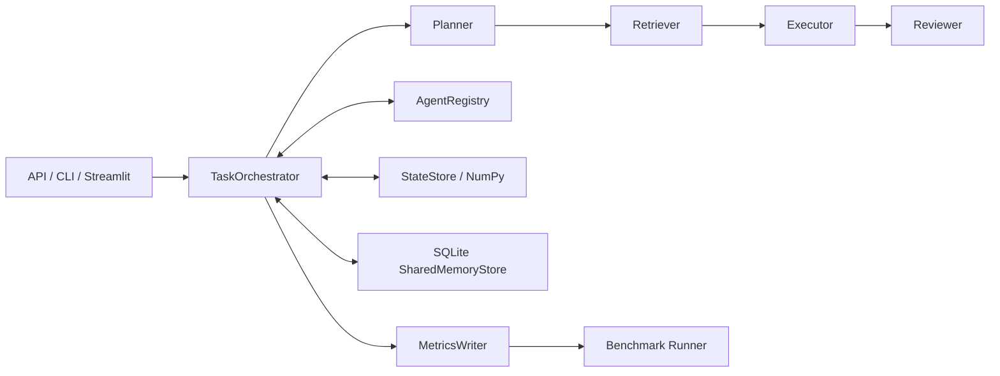

# MemLink

MemLink 是一套面向多智能体协作的低开销通信、非文本状态传递与跨任务共享记忆基础设施，用于“第三届中国研究生操作系统开源创新大赛”应用创新赛道第 10 题。

> 一句话介绍：让 Planner、Retriever、Executor、Reviewer 在纯文本基线与结构化协议之间可切换，并对通信、状态、记忆和执行成本进行真实、可复现的比较。

## 解决的问题

普通多 Agent Demo 往往把所有上下文反复拼进 Prompt，缺少能力发现、证据追踪、非文本状态、跨任务记忆和公平评测。MemLink 提供统一编排层，使这些机制可以独立启停、测量和消融。

## 核心创新

- 保留完整 text 基线，同时实现可版本化 structured 协议；
- 通过 AgentRegistry 按 capability 和 action 校验路由；
- 同一消息同时统计 JSON 与 MessagePack 的真实序列化字节；
- 大结果使用 `result_ref` 引用，消融配置可切换为完整结果传输；
- embedding 以 NumPy 二进制保存，协议只传递 `semantic_state_id`；
- SQLite 共享记忆支持关键词、标签和向量检索；
- 五配置 Benchmark 在隔离数据库和状态目录中公平运行；
- Windows 开发环境与 openEuler 24.03-LTS-SP3 x86_64 均已完成实际验证。

## 系统架构



详细设计见 [architecture.md](docs/architecture.md)。

## 四个 Agent

| Agent | 输入 | 输出 | 主要能力 | 工具权限 |
| --- | --- | --- | --- | --- |
| Planner | `PlannerInput` | `TaskPlan` | 规划、依赖、风险 | 无 |
| Retriever | `RetrieverInput` | `EvidenceBundle` | 关键词、标签、向量、记忆检索 | 只读检索 |
| Executor | `ExecutorInput` | `ExecutionResult` | 安全诊断执行 | `analyze_incident`、`validate_recovery` |
| Reviewer | `ReviewerInput` | `ReviewResult` | 证据校验、审查、记忆策展 | 无 |

Executor 的工具注册表没有 Shell 或任意代码执行能力。

## text 与 structured

- `text`：四次完整自然语言交接，不产生 MessagePack 协议消息。
- `structured`：使用 `AgentMessage`、capability、action、证据 ID、状态 ID 和结果引用传递上下文。

两种模式调用相同任务和模型适配器。通信差异见 [protocol_design.md](docs/protocol_design.md)。

## SemanticState

Fake 或真实 embedding 返回一维 `float32` NumPy 数组。StateStore 保存 `.npy` 与元数据，校验维度、dtype、字节数和 SHA-256。消息只传递状态 ID，不把向量转成字符串放入 Prompt。详见 [semantic_state_design.md](docs/semantic_state_design.md)。

## 共享记忆

SQLite 记忆与聊天历史分离。验证通过的结果可形成事实、证据、策略、成功或失败经验；后续同主题任务通过关键词、标签或向量相似度检索复用。详见 [memory_design.md](docs/memory_design.md)。

## 目录结构

```text
app/
├─ agents/       四个 Agent 及独立输入输出契约
├─ api/          FastAPI 路由
├─ benchmark/    实验矩阵、Runner、统计和输出
├─ core/         配置与日志
├─ llm/          Fake/DeepSeek 适配器
├─ memory/       SQLite 共享记忆
├─ models/       API 与运行领域模型
├─ protocol/     AgentMessage 与 AgentRegistry
├─ runtime/      编排器、指标、任务存储和安全工具
├─ state/        SemanticState 与二进制状态仓库
└─ ui/           Streamlit 演示页面与 presenter
benchmarks/      Benchmark 说明和运行结果目录
data/            示例任务及运行时数据
docs/            比赛交付文档
scripts/linux/   openEuler 脚本
tests/           离线单元与集成测试
```

## 技术栈

Python 3.11、FastAPI、Pydantic v2、pydantic-settings、SQLite、NumPy、MessagePack、httpx、pytest、Streamlit。

## Windows 安装与运行

只使用指定 Conda 解释器，不使用项目 `.venv`：

```powershell
D:\Users\fjy\AppData\Local\anaconda3\envs\memlink\python.exe -m pip install -r requirements-dev.txt
D:\Users\fjy\AppData\Local\anaconda3\envs\memlink\python.exe -m pip check
D:\Users\fjy\AppData\Local\anaconda3\envs\memlink\python.exe -m pytest -q
```

## openEuler 安装与运行

目标为 openEuler 24.03-LTS-SP3 x86_64：

```bash
bash scripts/linux/setup.sh
bash scripts/linux/test.sh
bash scripts/linux/run_demo.sh
bash scripts/linux/run_benchmark.sh 10
```

openEuler 24.03-LTS-SP3 x86_64 已使用 Python 3.11.6 和
`/home/fjy/memlink/.venv/bin/python` 完成实机验证：

```text
pip check: No broken requirements found.
pytest: 77 passed, 1 warning, 0 failed, 0 errors
```

完整步骤和实测记录见 [openEuler_deployment.md](docs/openEuler_deployment.md)。

## CLI

```powershell
D:\Users\fjy\AppData\Local\anaconda3\envs\memlink\python.exe -m app.cli run-demo --mode text --backend fake
D:\Users\fjy\AppData\Local\anaconda3\envs\memlink\python.exe -m app.cli run-demo --mode structured --backend fake
```

可附加 `--group rag|api --task-index 1|2|3`。

真实模型仅支持 DeepSeek。先按“DeepSeek 配置”创建本地 `.env`，再运行：

```powershell
D:\Users\fjy\AppData\Local\anaconda3\envs\memlink\python.exe -m app.cli run-demo --mode text --backend deepseek
D:\Users\fjy\AppData\Local\anaconda3\envs\memlink\python.exe -m app.cli run-demo --mode structured --backend deepseek
```

两种模式都会让 Planner、Retriever、Executor、Reviewer 分别调用一次所选
LLM 后端。DeepSeek 失败时程序直接返回脱敏错误，不会回退到 Fake。

## API

```powershell
D:\Users\fjy\AppData\Local\anaconda3\envs\memlink\python.exe -m uvicorn app.main:app --host 127.0.0.1 --port 8000
```

- `GET /health`
- `POST /api/v1/tasks/run`
- `GET /api/v1/tasks/{task_id}`

请求示例：

```json
{
  "title": "RAG 服务响应变慢",
  "prompt": "请区分检索和生成阶段并给出排查方案。",
  "task_topic": "enterprise-rag",
  "mode": "structured",
  "llm_backend": "fake"
}
```

## Streamlit 演示

```powershell
D:\Users\fjy\AppData\Local\anaconda3\envs\memlink\python.exe -m streamlit run app/ui/streamlit_app.py
```

页面支持任务输入、示例任务、双模式、Fake/DeepSeek 后端、三个消融开关、四
Agent 轨迹、通信指标、记忆、SemanticState、Reviewer 结果和阶段三真实
Benchmark。页面不接受 API Key；选择 DeepSeek 后只显示模型、Base URL 以及
“API Key 已配置/未配置”状态。

## Benchmark

```powershell
D:\Users\fjy\AppData\Local\anaconda3\envs\memlink\python.exe -m app.benchmark.cli run --rounds 10
D:\Users\fjy\AppData\Local\anaconda3\envs\memlink\python.exe -m app.benchmark.cli summarize
```

正式矩阵包含 `text`、`structured`、`structured_no_memory`、
`structured_no_semantic_state`、`structured_no_result_ref` 五种配置；
`ablation` 是选择完整矩阵的 CLI 别名，不是第六种实验。每组10轮、每轮6个任务，
共形成300条任务执行记录。Benchmark 入口固定使用 Fake LLM 和 Fake Embedding，
不访问互联网，用于离线复现、协议开销比较和消融分析。结果写入被 Git 忽略的
`benchmarks/results/`。方法与真实结果见
[benchmark_methodology.md](docs/benchmark_methodology.md) 和
[benchmark_report.md](docs/benchmark_report.md)。

## 测试

所有自动测试默认使用 Fake 模型；DeepSeek 客户端测试使用本地
`httpx.MockTransport`，两者都不访问真实 API：

```powershell
D:\Users\fjy\AppData\Local\anaconda3\envs\memlink\python.exe -m pytest -q
```

Windows 与 openEuler 当前真实结果均为：

```text
77 passed, 1 warning, 0 failed, 0 errors
```

## 验证结果与实验边界

需要区分以下四类结果：

1. **Windows 开发验证**：使用指定 Conda Python 完成依赖检查、77项 pytest、
   Fake 双模式回归和 DeepSeek 人工入口验证。
2. **openEuler 实机验证**：在 openEuler 24.03-LTS-SP3 x86_64、Python 3.11.6、
   `/home/fjy/memlink/.venv/bin/python` 下完成依赖、pytest 和 DeepSeek 人工验证。
3. **Fake Benchmark**：五组配置×10轮×6任务，共300条离线记录，用于可复现的
   协议开销与消融分析。
4. **真实 DeepSeek 演示**：用于证明四个 Agent 可以接入真实模型，不替代多轮
   Benchmark，也不用于推导跨任务性能结论。

一条已完成的 DeepSeek structured 演示使用模型 `deepseek-v4-pro`，执行轨迹为
`planner -> retriever -> executor -> reviewer`，任务成功完成。该次结果为9条消息、
估算 Token 1040、JSON 7734 B、MessagePack 7002 B、SemanticState 3次/384 B、
共享记忆命中15条，总耗时28107.309 ms。约28秒主要包含外部网络和真实模型推理
耗时，不能与毫秒级 Fake Benchmark 直接比较，也不说明 structured 在所有任务中
一定比 text 更快。

## DeepSeek 配置

Fake 是默认后端，用于 pytest、Benchmark 和离线复现。DeepSeek 只用于人工
CLI、API 或 Streamlit 演示，真实调用可能产生费用；不建议用真实模型重跑
现有 300 条正式 Benchmark。

API Key 只能保存在仓库根目录的 `.env`，不能写入源码、测试、README、命令行
参数或 Streamlit 输入框：

- Windows：`E:\memlink\.env`
- openEuler：`/home/fjy/memlink/.env`

不要覆盖已有 `.env`。首次配置时可复制 `.env.example`，再在本机编辑：

```dotenv
MEMLINK_LLM_BACKEND=fake
MEMLINK_DEEPSEEK_API_KEY=replace-me
MEMLINK_DEEPSEEK_BASE_URL=replace-with-deepseek-base-url
MEMLINK_DEEPSEEK_MODEL=replace-with-model-name
MEMLINK_LLM_TIMEOUT_SECONDS=60
MEMLINK_LLM_MAX_RETRIES=2
MEMLINK_LLM_TEMPERATURE=0.2
MEMLINK_LLM_MAX_TOKENS=1500
```

其中 API Key、Base URL 和模型名称必须由维护者按当前 DeepSeek 控制台与官方
文档填写。`.env.example` 只能保留占位符。用以下命令确认真实 `.env` 不会被
Git 跟踪：

```powershell
git check-ignore -v .env
git status --short --ignored .env
```

openEuler 中先进入固定部署目录再运行：

```bash
cd /home/fjy/memlink
.venv/bin/python -m app.cli run-demo --mode text --backend deepseek
.venv/bin/python -m app.cli run-demo --mode structured --backend deepseek
```

## 环境变量

| 变量 | 用途 |
| --- | --- |
| `MEMLINK_METRICS_DIR` | 原始任务指标目录 |
| `MEMLINK_STATE_DIR` | SemanticState 目录 |
| `MEMLINK_MEMORY_DB_PATH` | SQLite 记忆数据库 |
| `MEMLINK_ENABLE_*` | 记忆、状态和结果引用开关 |
| `MEMLINK_LLM_BACKEND` | `fake`（默认）或 `deepseek` |
| `MEMLINK_DEEPSEEK_API_KEY` | 仅从根目录 `.env` 提供的 DeepSeek 密钥 |
| `MEMLINK_DEEPSEEK_BASE_URL` | DeepSeek Chat Completions Base URL |
| `MEMLINK_DEEPSEEK_MODEL` | DeepSeek 模型名称 |
| `MEMLINK_LLM_TIMEOUT_SECONDS` | 单次请求超时 |
| `MEMLINK_LLM_MAX_RETRIES` | 429、超时和服务端错误的有限重试次数 |
| `MEMLINK_LLM_TEMPERATURE` | Chat Completions 温度 |
| `MEMLINK_LLM_MAX_TOKENS` | 单次 Chat Completions 最大输出 Token |
| `MEMLINK_EMBEDDING_*` | 可选 embedding 配置；DeepSeek 演示使用 Fake Embedding |

真实密钥不会进入任务请求、日志、异常、页面输出、指标或 Benchmark。
真实验证中页面和输出仅显示“API Key 已配置”，没有显示密钥内容。

## 演示任务

`data/examples/continuous_tasks.json` 提供两组连续任务：

- 企业 RAG：响应变慢、高并发超时、生成阶段延迟；
- 企业 API：HTTP 500、连接池耗尽、异步任务积压。

## 已知限制

- 当前是单进程、单机轻量实现，不提供分布式一致性；
- Fake Token 为统一字符估算，不等同厂商 tokenizer；
- 真实模型性能受提供方网络影响，正式离线结果使用 Fake；
- structured 在现有真实离线结果中字符、Token 和耗时高于 text；
- 单次 DeepSeek 演示只能验证真实模型接入，不能替代多轮 Benchmark；
- Streamlit 面向演示，不含登录、权限管理和多人隔离。

## 安全说明

- 不提供任意 Shell 执行工具；
- 不在页面、API 或结果中接收 API Key；
- `.env`、`.env.*`（`.env.example` 除外）、数据库、状态文件和 Benchmark
  结果默认忽略；
- 不提交 `.env`、SQLite 数据库、`.npy` 状态、原始 API Key 或包含密钥的日志；
- SQLite 使用参数化查询，状态读取校验哈希；
- 只结束明确属于本项目的后台进程。

## 开源协议

项目采用 [MIT License](LICENSE)。

## 项目截图

提交前需由维护者在最终 Windows 和 openEuler 环境中补充真实截图，建议放入 `docs/images/`：

1. Streamlit 任务与四 Agent 轨迹；
2. SemanticState 和共享记忆；
3. Benchmark 图表；
4. openEuler pytest、Demo 和服务运行证明。
