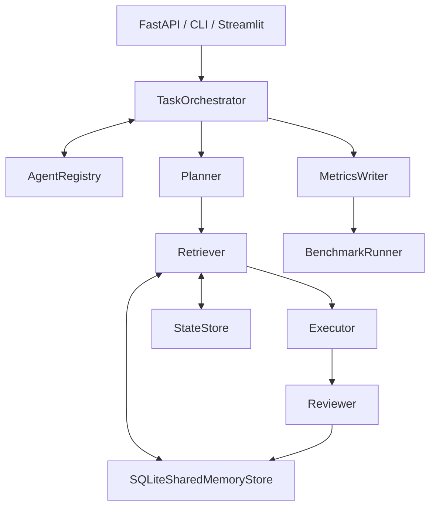
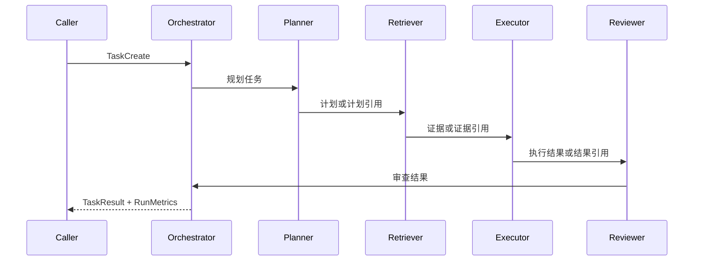
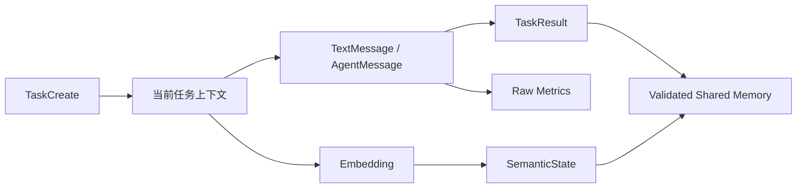

# MemLink 系统架构

## 1. 项目目标

MemLink 用可运行、可测试、可消融的基础设施验证多 Agent 的结构化通信、非文本状态和跨任务共享记忆。它同时保留纯文本基线，避免只展示 structured 而无法公平比较。

## 2. 总体架构

## 3. 组件职责

- `TaskOrchestrator`：选择 text/structured 分支、按序调用 Agent、管理状态、记忆、引用和指标。
- 四个 Agent：使用不同输入输出模型、system prompt、capability、action 和工具权限。
- `AgentRegistry`：注册 Agent，按 capability 发现并校验目标 action。
- `StateStore`：保存、索引并校验 NumPy 向量。
- `SQLiteSharedMemoryStore`：持久化、去重、查询和统计共享记忆。
- `MetricsWriter`：保存单任务原始指标。
- `BenchmarkRunner`：隔离五种配置、执行真实任务、保存原始记录并汇总。
- API/CLI/Streamlit：只调用服务层，不复制编排逻辑。

## 4. Agent 调用流程

Planner 不执行工具；Retriever 不形成最终结论；Executor 只能调用白名单确定性工具；Reviewer 校验证据和执行状态。

## 5. text 模式时序

text 分支进行四次完整自然语言交接。下一 Agent 只接收上一 Agent 的完整输出，最终 Reviewer 文本返回调用方。该模式不创建 `AgentMessage`，MessagePack 字节为 0。

## 6. structured 模式时序

structured 分支先记录四条 handshake，再依次发送 `plan_task`、`retrieve_evidence`、`execute_action`、`review_result` 和 `task_complete`。消息由 Registry 校验，结果可通过 `result_ref` 引用，SemanticState 仅通过状态 ID 传递。

## 7. AgentRegistry

每个注册项包含 agent ID、role、capability、accepted actions、输入输出模型和允许工具。`require_capability()` 先发现可用 Agent，再验证 action；`validate_message()` 拒绝能力或 action 不匹配。

## 8. protocol parser

当前没有独立的字符串 parser。Pydantic `AgentMessage` 负责字段校验，`from_msgpack_bytes()` 负责 MessagePack 解码后再进行模型校验。未知协议版本会被拒绝。

## 9. Orchestrator

编排器持有统一 LLM/Embedding 客户端、四个 Agent、Registry、TaskStore、StateStore、MemoryStore 和 MetricsWriter。三个布尔开关直接改变查询、状态创建和结果传输分支，而不是只修改标签。

## 10. StateStore

StateStore 使用 `pathlib.Path` 和 `.npy` 保存向量，同时保存 JSON 元数据。临时文件写完后通过原子替换落盘；读取时校验维度、dtype、字节数和 SHA-256。

## 11. SharedMemoryStore

SQLite 连接短时打开并在 `finally` 中关闭。记忆按内容哈希去重，重复项合并标签、证据和置信度；查询使用参数化 SQL。

## 12. MetricsWriter

每个任务写一份 UTF-8 JSON，包含消息、字符、Token 估算、JSON/MessagePack 字节、状态、记忆、引用、Agent 耗时、重试和错误。

## 13. Benchmark Runner

Runner 为每种配置创建新的系统临时目录、SQLite 和 StateStore。五种配置使用同一任务顺序、Fake 客户端、随机种子、轮数、超时和重试设置，结束后检查数据库句柄和临时目录。

## 14. API、CLI 和 Streamlit

- FastAPI 暴露健康检查、执行和查询接口。
- CLI 提供单任务 Demo 和 Benchmark 子命令。
- Streamlit 使用 `app.ui.service` 调用 TaskOrchestrator，通过 presenter 展示安全摘要。

## 15. 数据流

当前上下文、消息、SemanticState、共享记忆和 Benchmark 原始记录分别存储，避免概念混用。

## 16. 异常处理

Agent 异常转换为 `AgentExecutionError`，编排异常转换为 `OrchestrationError` 并把任务标记为 failed。Benchmark 捕获单任务异常并保存失败记录，但不会伪造成功；CLI 最终以非零状态反映失败。

## 17. 跨平台设计

业务路径使用 `pathlib.Path`；Windows 使用指定 Conda Python，openEuler 使用仓库内 `.venv`；Linux 脚本以脚本位置计算根目录并使用 LF。SQLite、NumPy 和标准临时目录均为跨平台实现。

## 18. 安全边界

API 和页面不接受 API Key；凭据只由 `pydantic-settings` 从环境读取。Executor 无 Shell 工具；真实模型客户端不在 repr、日志和结果中输出密钥；状态页面不加载完整向量。

## 19. 当前限制

系统仍是单机、单进程实现；TaskStore 为进程内存；没有分布式一致性、租户隔离和生产级权限控制。Fake Token 是统一字符估算。openEuler 脚本尚待实机验证。

